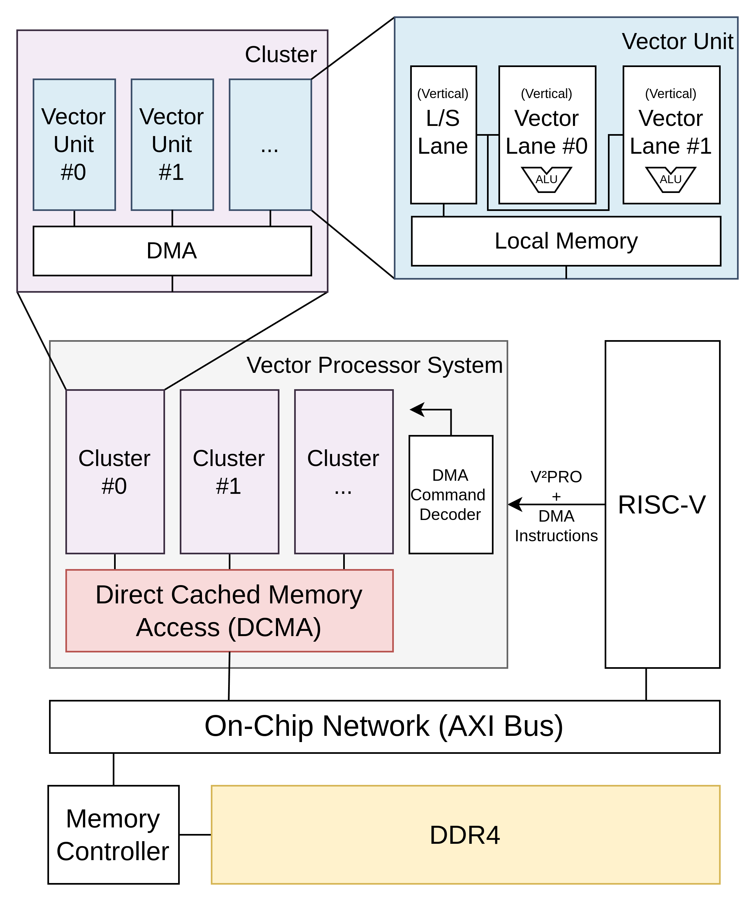

# V2PRO Vectorprocessor Instruction Set Simulator (ISS)

# Structure
- Example applications in `apps` folder
- ISS library files including architecture model (C-Code) in `iss_lib` folder
- Vpro function definitions library in `common_lib` folder

# V2PRO Vectorprocessor Architecture

[1]

The V2PRO architecture employs a massive-parallel approach based on vertical vector processing [1]. Unlike the more commonly known SIMD (single instruction, multiple data) paradigm, which follows a horizontal vector approach, the vertical method processes elements of multidimensional vectors sequentially. This, coupled with a complex addressing scheme [4] of vector elements, allows for efficient handling of not only linear vectors but also more intricate addressing schemes, such as those found in convolutional neural networks. Additionally, the vertical co-processor architecture delivers high performance by processing multiple vectors simultaneously on different data within parallel units.

Further information about the architecture can be found in [1].


# Getting Started
## Requirements
```
sudo apt-get install python3-opencv
```

## Run YOLO-LITE example
```
cd apps/yololite
make sim_yololite
```
This will run the YOLO-LITE [5] CNN with the example image in ```apps/yololite/nets/yololite/init```. 
The result image will be stored in ```apps/yololite/nets/yololite/exit```.

## V2PRO Programming Tutorial
TODO

# Publications
The V2PRO architecture is described in the following paper [1]. If you are using this work, please cite it as follows:

[1] Thieu, G. B.; Gesper, S.; Payá-Vayá, G.; Riggers, C.; Renke, O.; Fiedler, T.; Marten, J.; Stuckenberg, T.; Blume, H.; Weis, C.; Steinert, L.; Sudarshan, C.; Wehn, N.; Reimann, L. M.; Leupers, R.; Beyer, M.; Köhler, D.; Jauch, A.; Borrmann, J. M.; Jaberansari, S.; Berthold, T.; Blawat, M.; Kock, M.; Schewior, G.; Benndorf, J.; Kautz, F.; Bluethgen, H.-M.; Sauer, C. ZuSE Ki-Avf: Application-Specific AI Processor for Intelligent Sensor Signal Processing in Autonomous Driving. In 2023 Design, Automation & Test in Europe Conference & Exhibition (DATE 2023); IEEE, 2023; p 10136978. https://doi.org/10.23919/date56975.2023.10136978

Further publications:

[2] Gesper, S.; Thieu, G. B.; Köhler, D.; Kock, M.; Berthold, T.; Renke, O.; Blume, H.; Payá-Vayá, G. N V PRO: Neural Network Mapping Framework for a Custom Vector Processor Architecture. In ICCE-Berlin 2023 - IEEE 13th International Conference on Consumer Electronics - Berlin: Proceedings; IEEE, 2023; pp 94–99. https://doi.org/10.1109/icce-berlin58801.2023.10375652.

[3] Kautz, F.; Gesper, S.; Thieu, G. B.; Bluethgen, H.-M.; Blume, H.; Payá-Vayá, G. Multi-Level Prototyping of a Vertical Vector AI Processing System. In 35th IEEE International Conference on Application-specific Systems, Architectures and Processors (ASAP 2024); IEEE: Washington, DC, 2024; p 10631111. https://doi.org/10.1109/asap61560.2024.00011.

[4] Nolting, S.; Giesemann, F.; Hartig, J.; Schmider, A.; Payá-Vayá, G. Application-Specific Soft-Core Vector Processor for Advanced Driver Assistance Systems. In 27th International Conference on Field Programmable Logic and Applications (FPL); IEEE, 2017; pp 1–2. https://doi.org/10.23919/fpl.2017.8056836

# References
[5] J. Pedoeem and R. Huang, “YOLO-LITE: A Real-Time Object Detection Algorithm Optimized for Non-GPU Computers,” Nov. 13, 2018, arXiv: arXiv:1811.05588. doi: 10.48550/arXiv.1811.05588.

# Contributors
* Gia Bao Thieu (Technische Universität Braunschweig)
* Sven Gesper (Technische Universität Braunschweig)
* Jasper Homann (Technische Universität Braunschweig)
* Guillermo Payá Vayá (Technische Universität Braunschweig)
* Oliver Renke (Leibniz Universität Hannover)

# License
This open-source project is distributed under the MIT license.